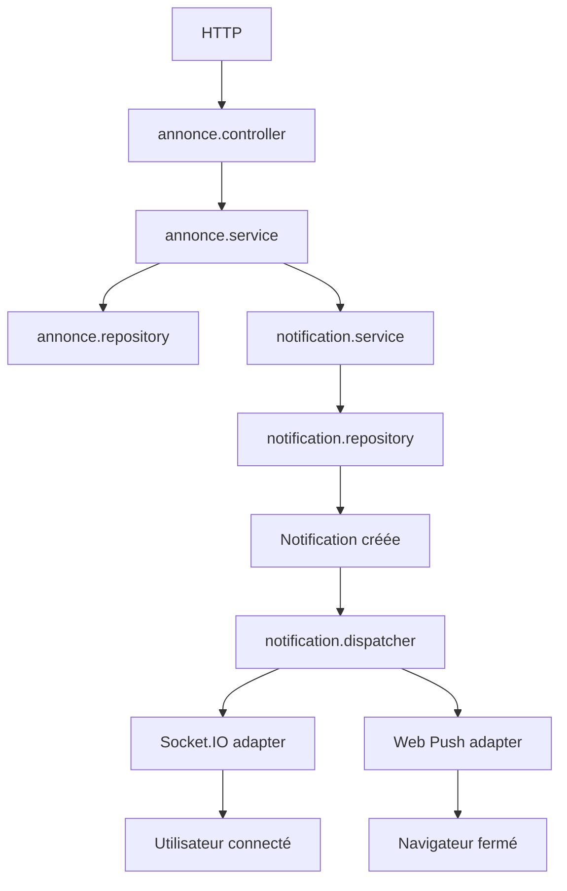

```mermaid
flowchart TD
    HTTP["HTTP"]
        --> CONTROLLER["annonce.controller"]

    CONTROLLER
        --> SERVICE["annonce.service"]

    SERVICE
        --> REPOSITORY["annonce.repository"]

    SERVICE
        --> NOTIFICATION["notification.service"]

    NOTIFICATION
        --> NOTIFICATION_REPOSITORY["notification.repository"]

    NOTIFICATION_REPOSITORY
        --> CREATED["Notification créée"]

    CREATED
        --> DISPATCHER["notification.dispatcher"]

    DISPATCHER
        --> SOCKET_ADAPTER["Socket.IO adapter"]

    DISPATCHER
        --> PUSH_ADAPTER["Web Push adapter"]

    SOCKET_ADAPTER
        --> CONNECTED["Utilisateur connecté"]

    PUSH_ADAPTER
        --> DISCONNECTED["Navigateur fermé"]
```
