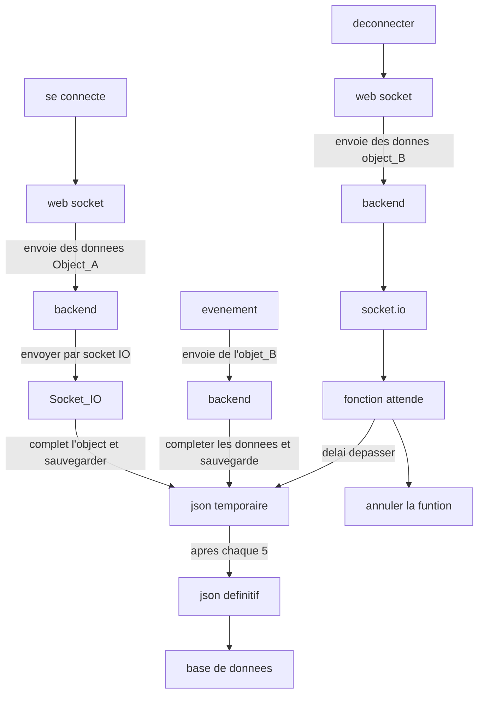

# object global de l'analytic

```js

    {
        "session_id": "c'est identtifiant de la  session lorsqu'il se connecte",
        "user_id": "c'est identifiant de l'utilisateur lorsqu'il est connecter",
        "date_creation": "c'est la date a laquelle la sesssion commence",
        "date_fin": "c'est la date a laquelle la session se termine",
        "type_visite": "si c'est la premiere ou une visite recurrente",
        "source": "ajouter un parametre qui permettra de dire d'ou viens l'utilisateur",
        "appareil": "telephone ou ordinateur",
        "page_entree": "page ou l'utilisateur est entree",
        "page_sortie": "page ou l'utilisateur est sortie",
        "navigateur": "le navigateur utilisee",
        "pays": "le pays",
        "la ville": "la ville de puis laquelle il reagit",
        "campaign": "pour voir a quelle occassion il est entree sur le site",
        "les pages visites": "c'est un tableau d'aobject",
        "duree": "duree sur le site",
        "research": "enregistrer les recherches dans un tableau",
        "annonce_visites": "enregistrer les annonces visites"
    }

```

## object de la page visite

```js

    {
        page_url,
        page_name,
        date_entree,
        date_sortie,
        duree,
    }

```



## fonctionnement de la base de donnees

```mermaid
    erDiagram
        Analictic{
            string user_id FK BA
            string role BA
            string session_id PK CO
            string analitic_id PK CO
            string createdAt BAC
            string leaveAt BA
            bool first_visite BA
            string source FO
            string device FO
            String navigateur FO
            string leave_page FO
            string enter_page FO
            string country BA
            string city BA
            string street BA
            array page_visite COMP
            array research COMP
            string campaign FO
            string annonces_visites COMP
        }

        page_event{
            string type FO
            string userId BA
            string session_id FK CO
            string page_url FO
            string createdAt BA
            string leaveAt BA
            int duree BA
        }

        research_event{
            string type FO
            string user_id BA
            string session_id FK CO
            object query FO
            int resultsCount  BA
            string createdAt BA
        }

        annonce_event{
            string annonce_id FO
            string user_id BA
            string session_id FK CO
            string createdAt BA
            string leaveAt BA
            int duree BA
        }

```